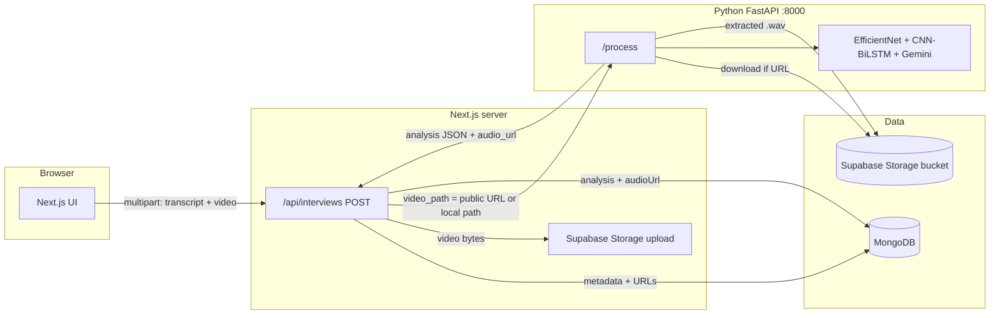

# MockMate — Architecture & Data Pipeline

This document describes how the browser, Next.js, MongoDB, Supabase Storage, and the Python (FastAPI) AI service work together after the Supabase integration.

## High-level diagram

## Step-by-step interview flow

1. **User finishes an interview** in the browser (records video + transcript).
2. **Next.js API** (`web/src/app/api/interviews/route.ts`):
   - Requires auth (session).
   - If **`SUPABASE_SERVICE_ROLE_KEY`** and **`NEXT_PUBLIC_SUPABASE_URL`** are set, uploads the video to the Storage bucket (default name: **`interviews`**) under `videos/{userId}/{timestamp}_interview.webm` (or `.mp4`).
   - Saves the **public URL** returned by Supabase in MongoDB as **`videoUrl`**.
   - If Supabase is not configured, falls back to **`public/uploads/`** on disk (dev-only; not portable across machines).
   - Creates an **Interview** document in MongoDB (transcript, `videoUrl`, `status: pending`).
3. **Next.js calls FastAPI** `POST /process` with:
   - `video_path`: either the **Supabase HTTPS URL** or a **local file path** (fallback).
   - `interview_id`, `transcript`, `user_id` (for audio object path).
4. **Python** (`api/main.py`):
   - If `video_path` is an **HTTP(S) URL**, **downloads** it to a temp file, then runs the same pipeline as before.
   - Runs **face / emotion** analysis on the video file.
   - Uses **ffmpeg** to extract a **temporary `.wav`** for the voice model.
   - **Uploads the extracted WAV** to Supabase at `audio/{userId}/{interviewId}.wav` when `SUPABASE_SERVICE_ROLE_KEY` is set (same env file is loaded via `python-dotenv` from `web/.env.local`).
   - Returns JSON including **`audio_url`** (public URL of the WAV) plus all analysis fields.
   - Deletes temp files (downloaded video, extracted audio).
5. **Next.js** updates MongoDB with **`analysis`**, **`audioUrl`** (from `audio_url`), and **`status: completed`** (or `failed` if Python errors).

## What is stored where

| Data | Location | Notes |
|------|-----------|--------|
| Transcript, scores, coaching text | **MongoDB** | Small JSON documents. |
| **Video file** | **Supabase Storage** | Large binary; MongoDB only stores **`videoUrl`**. |
| **Extracted interview audio** | **Supabase Storage** | WAV file; MongoDB stores **`audioUrl`**. |
| Temp files during processing | Local disk / OS temp | Deleted after analysis. |

## Environment variables (summary)

- **`web/.env.local`** (do not commit):
  - `NEXT_PUBLIC_SUPABASE_URL`, `NEXT_PUBLIC_SUPABASE_ANON_KEY` — client/project identity.
  - **`SUPABASE_SERVICE_ROLE_KEY`** — server-only; used by Next.js to upload video and by Python to upload audio. **Never expose to the browser.**
  - Optional: `SUPABASE_INTERVIEWS_BUCKET` (default `interviews`).
  - `PYTHON_API_URL` (default `http://localhost:8000`).
  - `GOOGLE_GENERATIVE_AI_API_KEY` — Gemini (used by Python).
- Python loads the same **`web/.env.local`** from the repo root so `SUPABASE_*` keys are available.

## Supabase dashboard checklist

1. **Storage → New bucket** named `interviews` (or match `SUPABASE_INTERVIEWS_BUCKET`).
2. For **public playback** in `<video>` / `<audio>` without signed URLs:
   - Bucket **public**, or
   - Policies that allow **authenticated read** and use signed URLs in the app (advanced).
3. For **uploads**, the **service role** key bypasses RLS; keep it **server-only**.

## Listening to audio later

- **Option A:** Play the **video** (`videoUrl`) — audio is inside the video.
- **Option B:** Use **`audioUrl`** — direct link to the **`.wav`** stored in Supabase (good for downloads or an `<audio>` player).

## Security notes

- Rotate keys if they were ever committed or shared.
- Prefer **private bucket + signed URLs** for production; this repo uses **public URLs** for simplicity when the bucket is public.
